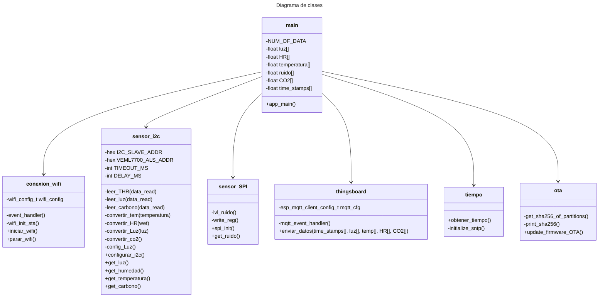

1. Diagrama de clases

```mermaid
---
title: Diagrama de clases
---
classDiagram
    class main{
        -NUM_OF_DATA
        -float luz[]
        -float HR[]
        -float temperatura[]
        -float ruido[]
        -float CO2[]
        -float time_stamps[]
        
        +app_main()


    }

    class conexion_wifi{
        -wifi_config_t wifi_config

        -event_handler()
        -wifi_init_sta()
        +iniciar_wifi()
        +parar_wifi()
    }

    class sensor_i2c{
        -hex I2C_SLAVE_ADDR
        -hex VEML7700_ALS_ADDR
        -int TIMEOUT_MS
        -int DELAY_MS

        -leer_THR(data_read)
        -leer_luz(data_read)
        -leer_carbono(data_read)
        -convertir_tem(temperatura)
        -convertir_HR(wet)
        -convertir_Luz(luz)
        -convertir_co2()
        -config_Luz()
        +configurar_i2c()
        +get_luz()
        +get_humedad()
        +get_temperatura()
        +get_carbono()
    }

    class sensor_SPI{
        -lvl_ruido()
        -write_reg()
        +spi_init()
        +get_ruido()
    }

    class thingsboard{
        -esp_mqtt_client_config_t mqtt_cfg
        -mqtt_event_handler()
        +enviar_datos(time_stamps[], luz[], temp[], HR[], CO2[])
    }

    class tiempo{
        +obtener_tiempo()
        -initialize_sntp()
    }

    class ota{
        -get_sha256_of_partitions()
        -print_sha256()
        +update_firmware_OTA()
    }

    main --> conexion_wifi
    main --> sensor_i2c
    main --> sensor_SPI
    main --> thingsboard
    main --> tiempo
    main --> ota


```