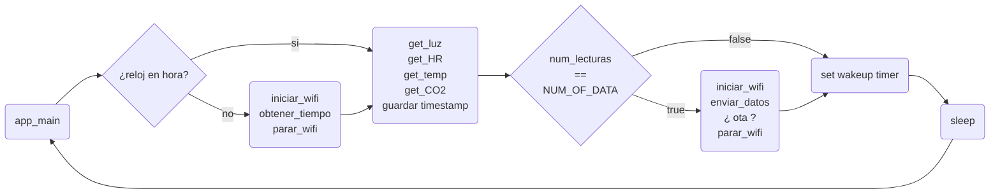

1. Diagrama de bloques

```mermaid

flowchart LR

    main(app_main)
    iftime{"¿reloj en hora?"}
    time("iniciar_wifi
    obtener_tiempo
    parar_wifi")

    sleep(sleep)


    datos("get_luz
    get_HR
    get_temp
    get_CO2
    guardar timestamp")

    enviardatos("iniciar_wifi
    enviar_datos
    ¿ ota ?
    parar_wifi")

    iflecturas{"num_lecturas
     == 
     NUM_OF_DATA"}


    wakeup(set wakeup timer)


    main --> iftime
    iftime -->|si| datos
    iftime -->|no| time
    time --> datos

    datos --> iflecturas
    iflecturas -->|true| enviardatos
    iflecturas -->|false| wakeup
    enviardatos --> wakeup
    wakeup --> sleep
    sleep --> main


```