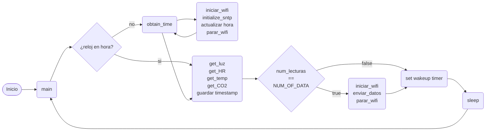

1. Diagrama de bloques

```mermaid

flowchart LR

    init([Inicio])
    main(main)
    iftime{"¿reloj en hora?"}
    time(obtain_time)
    sntp("iniciar_wifi
    initialize_sntp
    actualizar hora
    parar_wifi")
    sleep(sleep)


    datos("get_luz
    get_HR
    get_temp
    get_CO2
    guardar timestamp")

    enviardatos("iniciar_wifi
    enviar_datos
    parar_wifi")

    iflecturas{"num_lecturas
     == 
     NUM_OF_DATA"}


    wakeup(set wakeup timer)

    init --> main

    main --> iftime
    iftime -->|si| datos
    iftime -->|no| time
    time --> sntp
    sntp --> time
    time --> datos

    datos --> iflecturas
    iflecturas -->|true| enviardatos
    iflecturas -->|false| wakeup
    enviardatos --> wakeup
    wakeup --> sleep
    sleep --> main


```