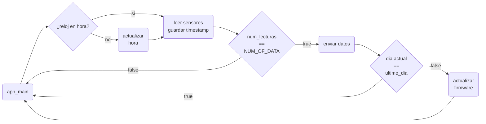

1. Diagrama de bloques

```mermaid

flowchart LR

    main(app_main)
    iftime{"¿reloj en hora?"}
    time("actualizar
     hora")


    datos("leer sensores
    guardar timestamp")

    enviardatos("enviar datos")

    iflecturas{"num_lecturas
     == 
     NUM_OF_DATA"}

    ifota{"dia actual
     ==
    ultimo_dia"}

    ota("actualizar
     firmware")


    main --> iftime
    iftime -->|si| datos
    iftime -->|no| time

    time --> datos

    datos --> iflecturas
    iflecturas -->|true| enviardatos
    iflecturas -->|false| main

    enviardatos --> ifota

    ifota -->|true| main
    ifota -->|false| ota
    ota -->main


```