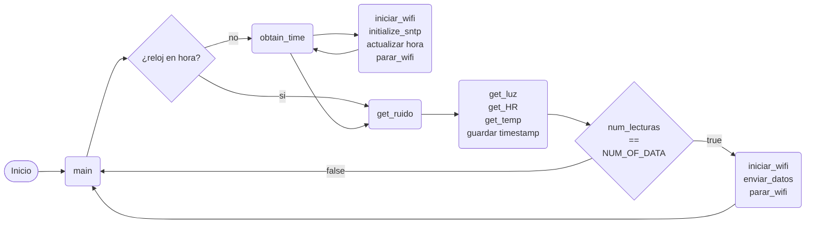

1. Diagrama de bloques

```mermaid

flowchart LR

    init([Inicio])
    main(main)
    iftime{"¿reloj en hora?"}
    time(obtain_time)
    sntp("iniciar_wifi
    initialize_sntp
    actualizar hora
    parar_wifi")


    datos("get_luz
    get_HR
    get_temp
    guardar timestamp")

    enviardatos("iniciar_wifi
    enviar_datos
    parar_wifi")

    iflecturas{"num_lecturas
     == 
     NUM_OF_DATA"}

    
    ruido(get_ruido)


    init --> main

    main --> iftime
    iftime -->|si| ruido
    ruido --> datos
    iftime -->|no| time
    time --> sntp
    sntp --> time
    time --> ruido

    datos --> iflecturas
    iflecturas -->|true| enviardatos
    iflecturas -->|false| main
    enviardatos --> main

```