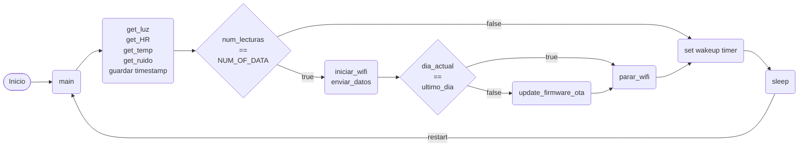

1. Diagrama de bloques

```mermaid

flowchart LR

    init([Inicio])
    main(main)

    sleep(sleep)


    datos("get_luz
    get_HR
    get_temp
    get_ruido
    guardar timestamp")

    enviardatos("iniciar_wifi
    enviar_datos")

    iflecturas{"num_lecturas
     == 
     NUM_OF_DATA"}

    ifota{"dia_actual
     ==
    ultimo_dia"}

    ota("update_firmware_ota")
    parar_wifi(parar_wifi)


    wakeup(set wakeup timer)

    init --> main

    main --> datos

    datos --> iflecturas
    iflecturas -->|true| enviardatos
    iflecturas -->|false| wakeup
    enviardatos --> ifota
    ifota -->|true| parar_wifi
    ifota -->|false| ota
    ota --> parar_wifi
    parar_wifi --> wakeup
    wakeup --> sleep
    sleep -->|restart| main


```